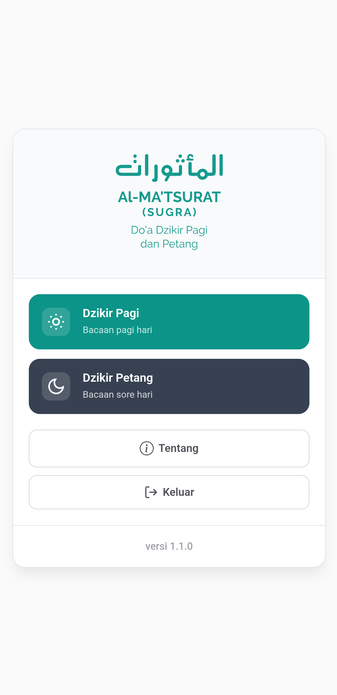
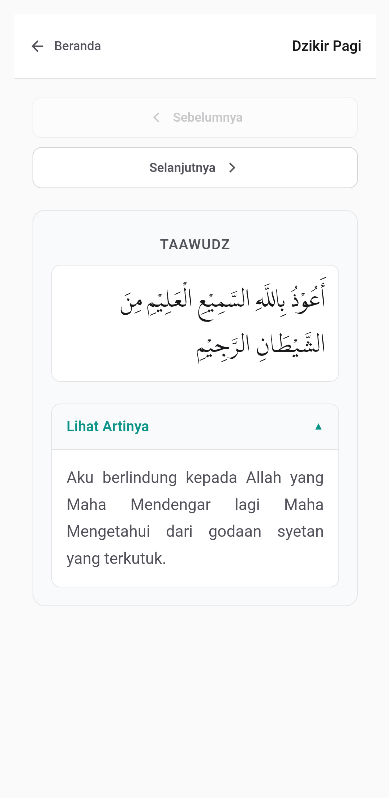
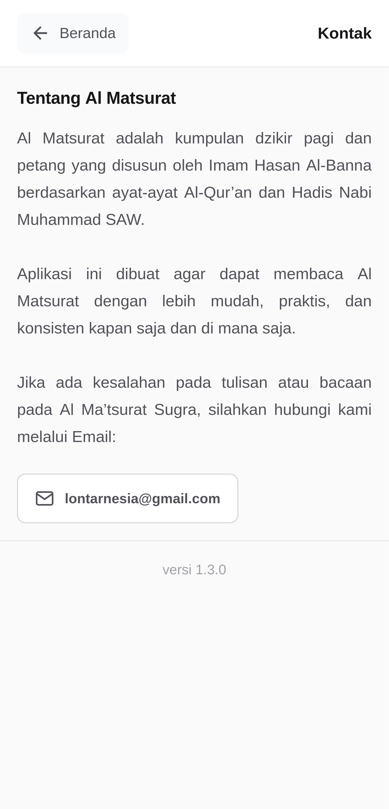

# Al-Ma'tsurat — Dzikir Pagi & Petang

Aplikasi Android Cordova untuk membaca dzikir pagi dan petang (Al-Ma'tsurat) dengan tampilan modern dan minimalis.

## Fitur

- Dzikir pagi & petang lengkap dengan teks Arab, latin, dan terjemahan
- Mode terang/gelap (toggle theme)
- Font Arab (LPMQ IsepMisbah + Amiri)
- Splash screen kustom
- Ringan & offline

## Screenshot

| Beranda | Dzikir Pagi | Tentang |
|---------|-------------|---------|
|  |  |  |

## Tech Stack

- [Apache Cordova](https://cordova.apache.org/) — wrapper Android
- HTML + CSS + Vanilla JS — frontend
- Plugin: `cordova-plugin-splashscreen`

## Build

```bash
cordova build android
```

## Dev

```bash
cordova run android
```

## Struktur

```
├── www/              # Frontend (HTML, CSS, JS, assets)
│   ├── index.html    # Beranda
│   ├── dzikirpagi.html
│   ├── dzikirpetang.html
│   ├── about.html
│   ├── source/       # Data dzikir (JSON)
│   └── img/          # Screenshot, logo, favicon
├── assets/           # Icon & splash screen
├── platforms/        # Platform Android
├── plugins/          # Plugin Cordova
└── config.xml        # Konfigurasi Cordova
```

## Lisensi

Apache-2.0 © [Lontarnesia / iairydev](https://github.com/iairydev)
